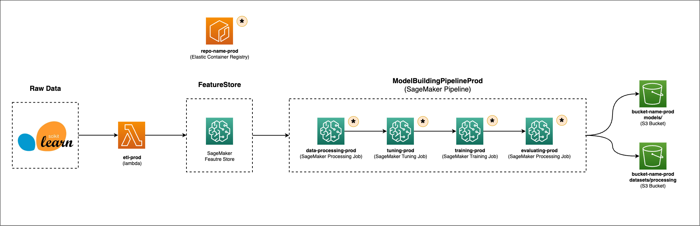
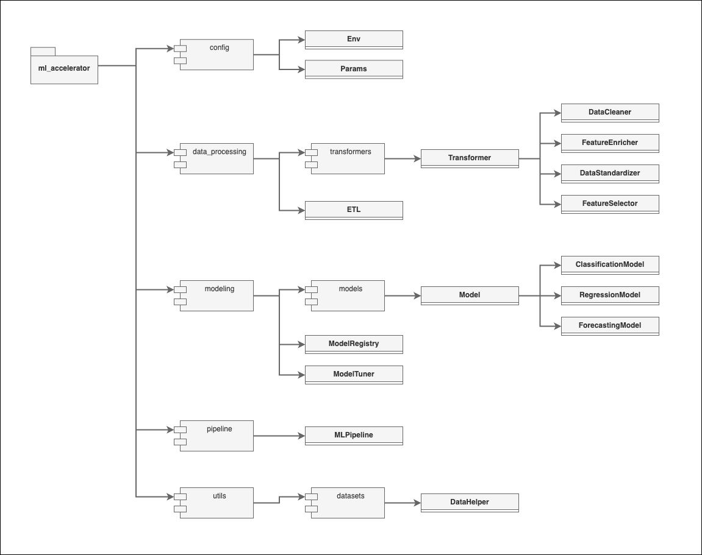

<div align="center">

</div>

&nbsp;
&nbsp;
# ml-accelerator
ml_accelerator is a propietary library designed to accelerate the development of various Machine Learning proyects; including:
- `Binary classification` projects
- `Multi class classification` projects
- `Regression` projects
- `Forecasting` projects

The repository is equipped with modules that will automate:
- `Data cleaning` tasks
- `Feature engineering` tasks
- `Feature transformation` tasks
- `Feature selection` tasks
- `Hyperparameter tuning` tasks
- `Training` tasks
- `Evaluating` tasks

In addition to this, the repository is designed to:
- Manage the ent-to-end `ML lifecycle`, from model development to model deployment
- Deploy a streamlit `web-app` to visualize model performances
- Build, deploy and mantain the `infrastructure` required to run ML workflows, leveraging various `AWS` services

&nbsp;
# Table of Contents

- [Installation](#installation)
- [Usage](#usage)
- [Documentation](#documentation)
  - [Infrastructure](#infrastructure)
  - [Repository Structure](#repository-structure)
  - [Scripts](#scripts)
  - [Config Parameters](#config-parametrs)
  - [Environment Parameters](#environment-parameters)

&nbsp;
# Installation

1. Install the AWS CLI v2 (if it's not already installed)
```bash
curl "https://awscli.amazonaws.com/AWSCLIV2.pkg" -o "AWSCLIV2.pkg"
sudo installer -pkg ./AWSCLIV2.pkg -target /
```
2. Set up the IAM credentials using aws configure:
```bash
aws configure
```
```
AWS Access Key ID: AWS_ACCESS_KEY_ID
AWS Secret Access Key: AWS_SECRET_ACCESS_KEY
Default region name: region-name
Default output format: json
```
3. Install & run the [Docker Desktop](https://docs.docker.com/engine/install/) application (if it's not already installed).
4. Create a new private [GitHub](https://github.com/) repository.
- Note: do *not* include README.md, .gitignore or LICENSE files
5. Clone new created repository:
```bash
git clone https://github.com/<username>/<repository-name>.git
```
6. Unzip `ml-accelerator-latest.zip` file and add it's components in the new repository.
7. Create & activate a new python virtual environment:
```bash
python -m venv .venv
source .venv/bin/activate
```
8. Install the ml_accelerator module in "editable" mode:
```bash
pip install -e .
```
  - *Note that this command will also install the dependencies, specified in `requirements.txt`.*
9. Create and populate a `.env` file, following the structure from `.env.example`
10. (Optionally) Create a `.vscode/` directory with a `setting.json` file, as such:
```json
{
    "python.testing.unittestArgs": [
        "-v",
        "-s",
        "./test",
        "-p",
        "test_*.py"
    ],
    "python.testing.pytestEnabled": false,
    "python.testing.unittestEnabled": true,
    "python.defaultInterpreterPath": "./.ml_accel_venv/bin/python"
}
```
11. Add, commit & push changes to remote git repository.
```bash
git add .
git commit -m "First commit."
git push -u origin main
```
12. Generate a new [fined-grained Personal access token](https://github.com/settings/tokens?type=beta)
13. Create a new private project in [AzureDevOps](https://dev.azure.com/)
14. Import newly created repository utilizing (which requires authentification):
- Clone URL: https://github.com/<username>/<repository-name>.git
- Username: <username>
- PAT: personal_access_token_value
15. Add Azure DevOps as a new remote repository
```bash
git remote add azure https://dev.azure.com/<Organization>/<NewProject>/_git/<repository-name>
git push -u azure main
```
- Note: this will prompt to add git username and PAT
16. Open a [SageMaker Studio Domain](https://sa-east-1.console.aws.amazon.com/sagemaker/home?region=sa-east-1#/studio-landing) and run a code-editor space.
17. Clone the GitHub repository in the code-editor space.

&nbsp;
# Usage

Define required parameters in the `config/config.yaml` file to specify specific functionalities:
- `PROJECT_PARAMS`: general project parameters.
  - Note: currently only *binary_classification* is available.
- `ETL_PARAMS`: parameters to define ETL workflow.
  - Note: currently, ETL is designed to ingest datasets from *sklearn*.
- `STORAGE_PARAMS`: parameters to define how to store datasets.
- `DATA_CLEANING_PARAMS`: parameters to define data cleaning pipeline.
- `FEATURE_ENRICHER_PARAMS`: parameters to define feature engineering pipeline.
- `DATA_TRANSFORMING_PARAMS`: parameters to define data transformation pipeline.
- `FEATURE_SELECTION_PARAMS`: parameters to define feature selection pipeline.
- `ML_DATASETS_PARAMS`: parameters to define train-val-test splits.
- `CLASSIFICATION_PARAMS`: parameters specific for classification projects.
- `REGRESSION_PARAMS`: parameters specific for regression projects.
  - Note: currently not implemented.
- `FORECASTING_PARAMS`: parameters specific for forecasting projects.
  - Note: currently not implemented.
- `HYPER_PARAMETER_TUNING_PARAMS`: parameters to define hyperparameter-tunning tasks.
- `FEATURE_IMPORTANCE_PARAMS`: parameters to define how to measure feature importance in ML models.
- `MLPIPELINE_PARAMS`: parameters to define how to create MLPipelines.
- `MODEL_BUILDING_PARAMS`: parameters to define model building workflow.
- `STEP_FUNCTION_STATES`: parameters to define step function states.
- `LOG_PARAMS`: parameters to define logging configuration.

(See [Config Parameter](#config-parametrs) for more details on each of these groups).

(Optionally) Define `.env` & `.tfvars` parameters (see [Environment Parameters](#environment-parameters)) for more details on each of these groups.

Run `./main.sh` bash script (entrypoint) in order to:
1. Build an `ECR repository` with *Terraform*, where the Docker images will be stored.
2. Build `Docker images` required to run the workflows.
3. `Tag` & `push` docker images into the ECR repository.
4. Build the infrastructure required to run the workflows, including:
  - `S3 Bucket` to store datasets & models.
  - `Lambda function` to run ETL pipeline.
  - `Step Function` to orchestrate Model Builing Jobs. `SageMaker Processing Jobs`.
5. Run `ETL workflow`, through a `lambda` function. 
6. Run a `Model Building workflow`, through a `Step Function` that orchestrate the following `SageMaker Processing jobs`:
  - `data-processing`: run a data processing pipeline that leverages the following classes (ran sequentially):
    - *DataCleaner*: applies data cleaning methods.
    - *FeatureEnricher*: applies feature engineering methods to create new features.
    - *DataStandardizer*: applies data transformation steps to standardize numerical features, one-hot-encode categorical features & encode target.
    - *FeatureSelector*: applies various feature selection methods to pick the subset of features that add the most predictive power.
  - `tuning`: utilizes the *ModelTuner* class to tune hyperparameters & select the top performant models based on their performance on validation datasets.
  - `training`: utilizes top performant models to build & train *MLPipelines*.
  - `evaluating`: evaluates built MLPipelines with test datasets & picks champion MLPipeline.
7. Run a `streamlit web-app` to visualize model performances.

&nbsp;
# Documentation

## Infrastructure

<div align="center">

</div>

## Class Structure

<div align="center">

</div>

## Scripts

## Config Parametrs

## Environment Parameters